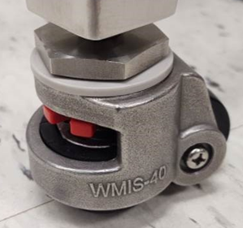

# Securing the Stand Leveling Casters

**Leveling the Casters**

Proper leveling of the ONTOS _CLEAN_ is essential to ensure stability and optimal performance. Follow these steps to achieve accurate caster leveling:


After an adjustment, use a bubble level on top of the system to check for level.


<figure><figcaption>
Caster with Red Wheel Adjustment
</figcaption></figure>

<figure><figcaption>
Caster with leveling pad
</figcaption></figure>


1. **Caster Adjustment:** use the red thumbwheel to either lower or raise the leveling pad, as shown in the diagram above.&#x20;
2. **Leveling Considerations:** As you begin to level one foot of the system, it may bring the corresponding caster down onto the pad, potentially achieving an overall level. However, for complete stability, it's crucial to have each caster firmly resting on its respective pad.
3. **Verify Each Caster:** After adjusting and leveling each foot of the system, ensure to check that the associated caster is securely placed on its pad. Repeat this process for all four casters to achieve uniform and accurate leveling.
4. **Stability Check:** Gently test the stability of the ONTOS _CLEAN_ after leveling. Ensure there's no wobbling or unevenness, confirming that the system is securely balanced on all four casters.


