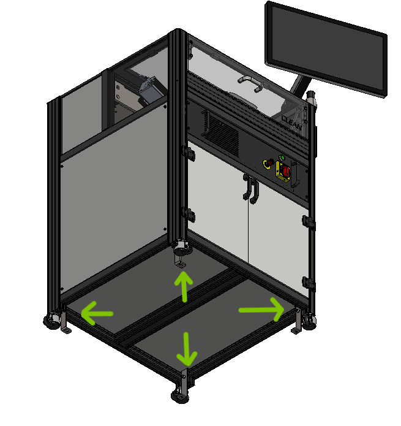

# Seismic Anchoring Installation

The ONTOS _CLEAN_ must be securely anchored to prevent movement or displacement during seismic events. Proper seismic anchoring is crucial to ensure the safety of personnel, protect the equipment, and maintain the system's operational integrity. This section outlines the guidelines and procedures for effectively anchoring the ONTOS _CLEAN_ in seismic-prone regions.

#### Seismic Anchoring Requirements

Before proceeding with the seismic anchoring process, it is essential to understand the seismic requirements specific to your location and facility. Local building codes, regulations, and seismic design criteria should be consulted to determine the necessary anchoring specifications. The goal is to ensure that the tool remains stable and intact even in the event of an earthquake.

<figure><figcaption></figcaption></figure>

#### Anchoring Preparation


* **Location Assessment:** Identify the designated installation area for the ONTOS _CLEAN_. Consider factors such as proximity to walls, structural elements, and other equipment that may impact the anchoring process.
* **Anchoring Kit:** Obtain the appropriate seismic anchoring kit that complies with the recommended anchoring methods and regulations.
* **Equipment Inspection:** Prior to installation, thoroughly inspect the anchoring kit components, including brackets, bolts, nuts, washers, and any required tools.


#### Anchoring Procedure


1. **System Shutdown:** Ensure that the ONTOS _CLEAN_ is powered off and disconnected from all power sources.
2. **Preparation:** Clear the installation area of any obstructions, debris, or obstacles that could hinder the anchoring process.
3. **Bracket Placement:** Carefully position the anchoring brackets at predetermined locations on the ONTOS _CLEAN_ base or designated anchoring points.
4. **Marking:** Use a marker or chalk to indicate the positions of the bracket mounting holes on the floor.
5. **Drilling:** Using a suitable drill and drill bit, create holes at the marked positions on the floor. The hole size and depth should correspond to the specifications provided by the anchoring kit manufacturer.
6. **Bolt Insertion:** Insert the provided anchor bolts into the drilled holes, ensuring they are securely seated.
7. **Bracket Attachment:** Place the anchoring brackets over the anchor bolts and align them with the holes. Attach the brackets to the ONTOS _CLEAN_ base using the appropriate hardware as indicated in the anchoring kit instructions.
8. **Tightening:** Gradually tighten the nuts onto the anchor bolts using the specified torque values to secure the brackets in place. Follow the recommended tightening sequence for uniform distribution of forces.


#### Verification and Testing


* **Double-Check:** Inspect the anchoring brackets, bolts, and nuts to confirm that they are properly installed and tightened according to the manufacturer's instructions.
* **Stability Test:** Gently apply pressure to the ONTOS _CLEAN_ to check for any movement or instability. The system should remain firmly anchored.
* **Professional Review:** If required by local regulations, seek the expertise of a professional engineer or seismic expert to review and verify the adequacy of the anchoring installation.


#### Final Notes

Failure to properly anchor the ONTOS _CLEAN_ can result in severe consequences during seismic events. Always prioritize safety and compliance when performing seismic anchoring procedures.

For further assistance or guidance on seismic anchoring, please contact our service team at [service@set-na.com](mailto:service@set-na.com).
