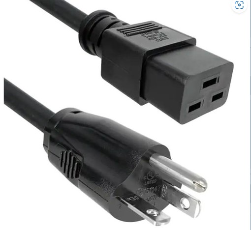
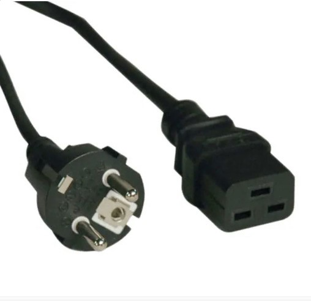
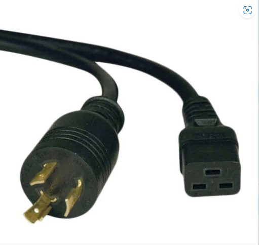

# Utilities

**Utilities**

It is recommended to maintain an exclusion zone for service and installation.

Order of gasses may change for each tool based on customer requirements, please see the purchase order for your specific tool.



**Power Consumption:** The system's power consumption is rated at 1900 W (16A@120V / 8A@240V), 50/60 Hz with a tolerance of ±10%.

**Recommended Utility:** To ensure optimal performance, it is recommended to provide a power supply of 20A@120V / 10A@240V, 50/60 Hz.

**Power Plug**: See Below


Ensure the detachable MAINS supply cord is adequately rated for the specified power requirements.


***

Three power plug cables are available for the tool, consult your purchase order to verify the correct cable:

* CORD 12AWG 5-20P - 320-C19 8.2' (USA Applications)

<figure><figcaption>
PN#CA-000070
</figcaption></figure>

* CORD CEE 7/7 TO IEC 320-C19 8' (Euro Style, 250VAC Applications)

<figure><figcaption>
PN#CA-000071
</figcaption></figure>

* CRD 12AWG NEMAL6-20P - 320C19 6' (USA 220VAC applications)

<figure><figcaption>
PN#CA-000072
</figcaption></figure>




Gas Connections: ¼” Swagelok® compression fitting



Hydrogen concentration: 3-5%, in compliance with local LEL standards.


Gas #1 - Argon ≥ 20 SLPM (\~0.8 CFM)

Gas #2 - Argon/(5%)Hydrogen ≥ 20 SLPM (\~0.8 CFM)

Gas #3 - Helium: Flow rate ≥ 20 SLPM (\~0.8 CFM)

Gas #4 - Helium/(5%)Hydrogen: Flow rate ≥ 20 SLPM (\~0.2 CFM).

Gas #5 - Oxygen (optional): Flow rate ≥ 0.5 SLPM (\~0.02 CFM)

Gas #6 - Nitrogen: Flow rate ≥ 0.5 SLPM (\~0.02 CFM)



* Exhaust: 4-inch connection, blade-regulated to 600-800 SLPM


Consider using a “Blast-Gate” type Damper to adjust flow rate.





Avoid exposing the system to external moisture, liquids, or high humidity exceeding 70% RH.




House vacuum: -0.85 \~ -0.85 bars (2 \~ 10 SLPM).


