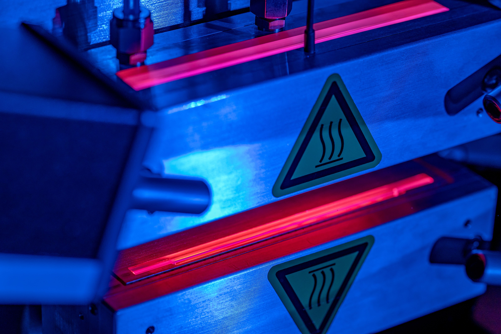

# Introduction

Introducing the ONTOS _CLEAN_: Your solution to Advanced Atmospheric Plasma Treatment. As you begin using the ONTOS CLEAN system, we hope to exceed your expectations with our plasma treatment system. This section offers indispensable insights for its safe operation. Built to meet stringent safety standards, the machine's utilization of temperature, force, voltage, process gases, and reactions underscores the importance of adhering to correct procedures to ensure operator well-being.

<figure><figcaption>
ONTOS <em>CLEAN</em>
</figcaption></figure>


**The** :warning: **symbol is on the front of the control rack indicates that the manual must be read before powering, tampering or operating the system. The instructions and information in this manual are intended for trained and qualified personnel only. Do not attempt to operate this machine until you have been properly trained and certified to do so.**

