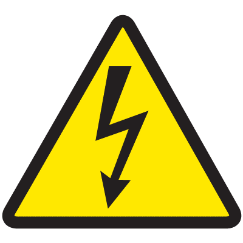
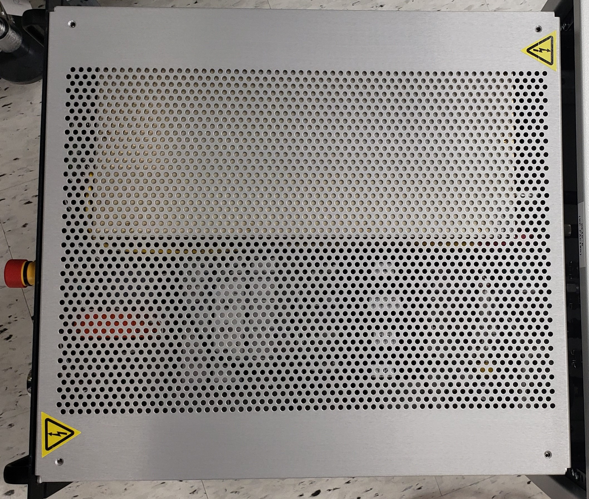
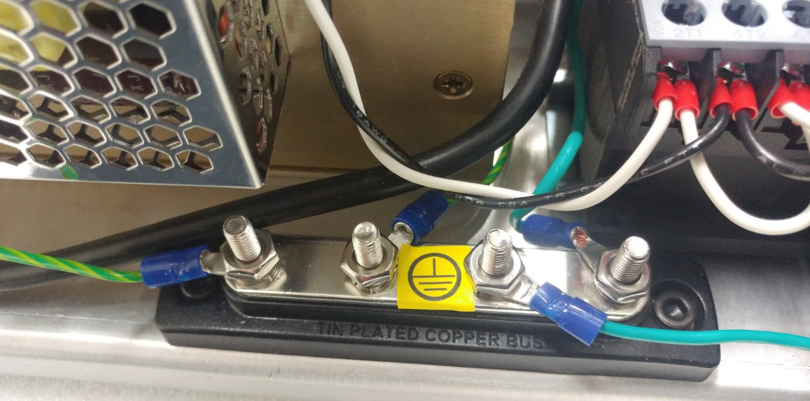

# Electrical Hazards and Precautions

The ONTOS _CLEAN_ incorporates various electrical components and systems, some of which can pose potential electrical hazards. Caution should be exercised to ensure your safety and the integrity of the equipment.

**Warning Symbols:** Watch for warning symbols like those shown here, which may be affixed to your machine to highlight areas with specific electrical hazards.

<figure><figcaption>
Warning Symbol
</figcaption></figure>

**Voltage Presence:** Several parts of the machine may harbor voltages that could lead to dangerous or even lethal shocks. Particular attention must be paid to the Radio Frequency (RF) Generator and the RF Impedance Matching Network Module associated with the plasma source.

**Module Covers:** Module covers should not be removed except by personnel who have undergone factory training. Unauthorized access can result in electrical hazards or equipment malfunction.

**RF Cabling:** Under no circumstances should RF cabling be disconnected unless the system is powered down and the main power cable is disconnected from its source.

**Operating Voltage Areas:** Operating voltage is prevalent in all sections of the control rack, as well as within motors and actuators within the process enclosure. These regions are safeguarded by covers and/or interlocks that must remain intact and operational during machine use.

**Tool Usage:** Any task necessitating tools (e.g., screwdrivers, wrenches, Allen keys) should exclusively be undertaken by factory-trained personnel.

**Main Power Cable:** The main power cable is designed to be detachable from the unit. If you opt to replace this cable with a user-supplied alternative, ensure it can support power requirements of 120VAC/20A or 240VAC/10A.

**Single-Point Earth Ground:** The Control Chassis subsystem features a designated single-point-earth-ground terminal, which is clearly identified by a sticker affixed as depicted below.

By heeding these precautions and understanding the potential electrical hazards, you play an essential role in ensuring your safety and the reliable operation of the ONTOS _CLEAN_.&#x20;


Any procedure which requires the use of tools (i.e., screwdriver, wrench, Allen key, etc.) is to be performed by factory-trained personnel only).

