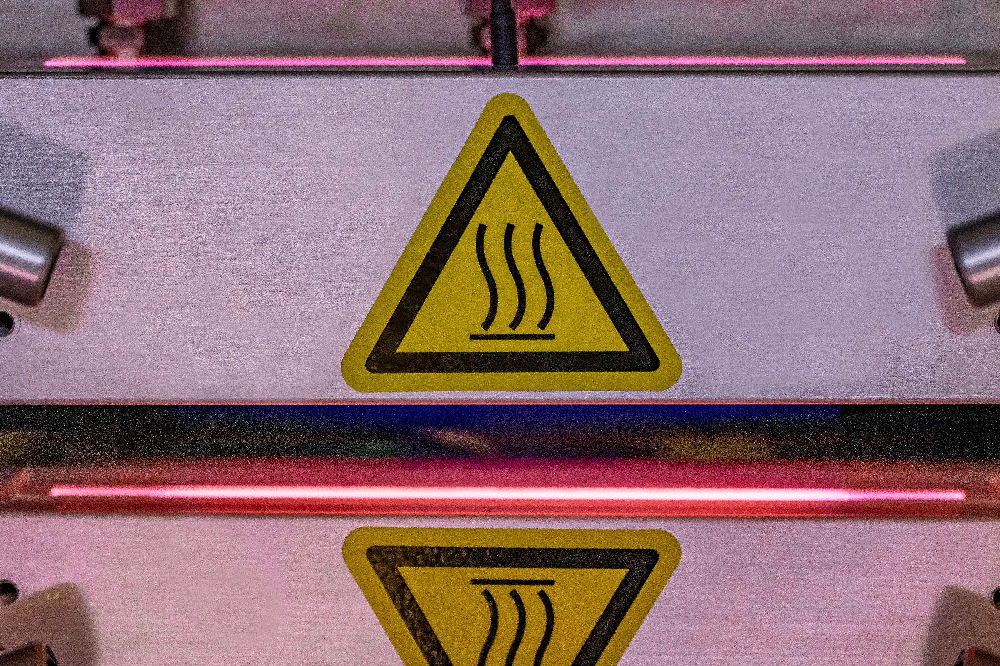

# Physical Risks at the Plasma Head:

Within the ONTOS _CLEAN_, physical risks are associated with the Plasma Head, a component emitting a plume resulting from internal reactions. This plume might contain hot gases, leading to potential hazards. It's crucial to recognize and mitigate these risks when operating the equipment.

**Elevated Temperatures:** The Plasma Head's operational cycle can elevate its temperature up to 150°C, even after the processing has concluded. This heat emission can pose a risk to operators and personnel in proximity. Warning labels are affixed to surfaces in the vicinity of the Plasma Head to alert users to potential dangers.

**Exercise Caution:** In situations necessitating interaction with the Plasma Head or its surrounding structure, caution is paramount. Due to the elevated temperatures and potential for emitting hot gases, ensure appropriate protective measures and follow established safety protocols to prevent burns or other injuries.

<figure><figcaption>
Warning Symbol
</figcaption></figure>


**Warning symbols such as these may be installed on your machine to indicate areas of thermal hazard.**


**Preventive Measures:** To minimize physical risks associated with the Plasma Head:


* Adhere to all warning labels placed on surfaces near the Plasma Head.
* Avoid direct contact with the Plasma Head and its surrounding structure during and after processing.
* Wear suitable personal protective equipment (PPE) as recommended by safety guidelines.


By following safety protocols and utilizing appropriate protective equipment, you can minimize the physical risks associated with the Plasma Head and its emitted plume.

