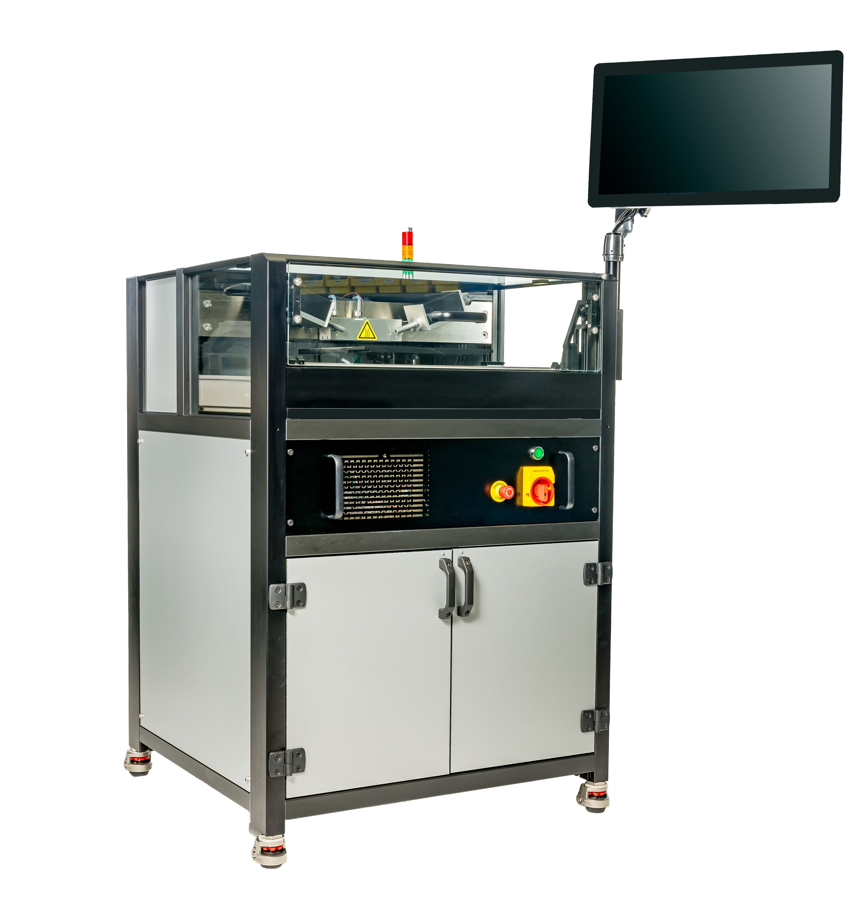

# What is the ONTOS CLEAN?

The ONTOS _CLEAN_ is a surface preparation tool which uses a stable plasma at atmospheric conditions to alter the surface of a substrate. Process capability includes, but is not limited to, surface cleaning, oxide reduction, organic reduction or surface activation.

Typical subsequent processes might include soldering, joining, bonding, etching, deposition, plating, or other semiconductor fabrication or assembly steps.&#x20;

<figure><figcaption>
ONTOS <em>CLEAN</em> System
</figcaption></figure>

