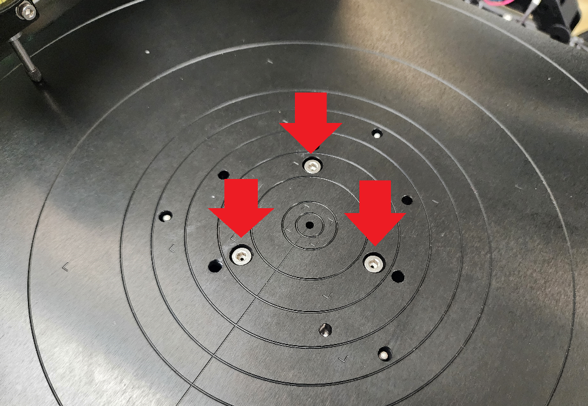
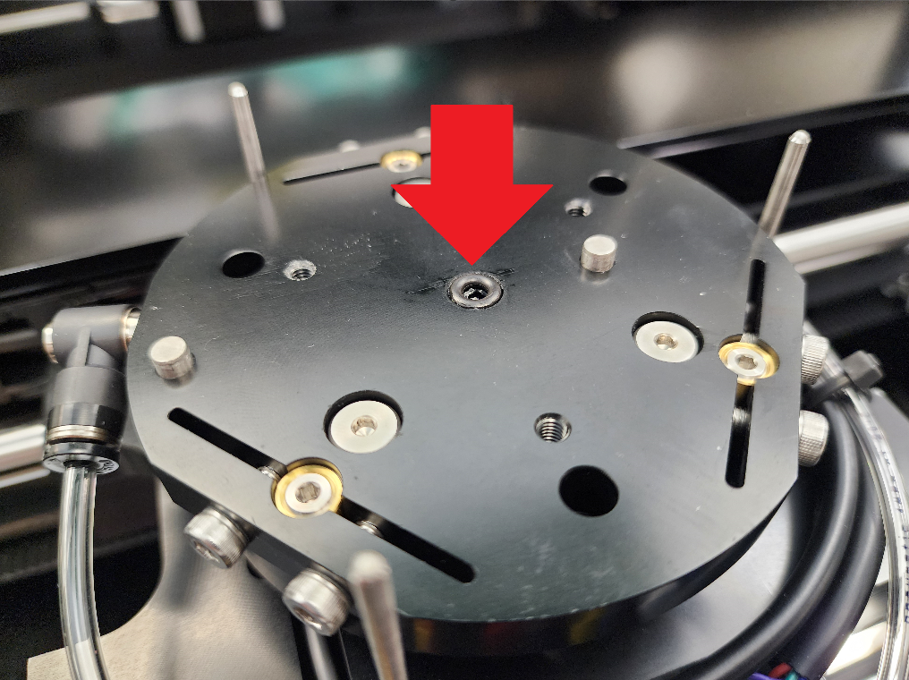

# Chuck Swap


1. Power the tool off.
2. Follow all required lockout/tagout procedures.
3. [Remove the rear service panel](broken-reference).
4. [Remove the front service panel](broken-reference).&#x20;
5. [Remove the Ellipsometer Optics](broken-reference).
6. Manually maneuver the stage towards the front of the machine to clear the plasma head.
7. Using a 3mm allen wrench, unscrew the three screws shown below.
8. With the screws removed, carefully lift up to remove the chuck.
9. Ensure that the O-ring that sits on the bottom of the chuck is retained on the stage. If the O-ring is pulled off with the chuck, remove it from the chuck and reinstall onto the stage.&#x20;
10. Replace new chuck onto stage, using the 3mm allen wrench to reinstall the 3 screws.


<figure><figcaption>
Chuck Hex Screws
</figcaption></figure>

 

<figure><figcaption>
Chuck O-ring
</figcaption></figure>

