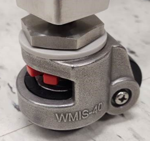

# Securing the Stand Leveling Casters

To perform an adjustment of the casters, turn the red thumbwheel to lower or raise the leveling pad as seen below.

The pads underneath the casters should all&#x20;


After an adjustment, use a bubble level on top of the Ontos3 to check for level.


|  |  |
| ------------------------------ | ------------------------------------------------------------------------------------------------------------------------------------------------------ |
| Leveling Feet Casters          | Work Stand Bubble Level                                                                                                                                |

