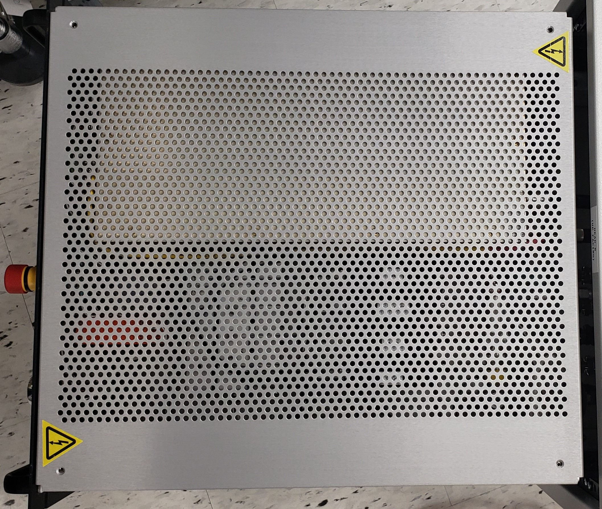

# ⚡ Electrical Hazards (cont.)


Any procedure which requires the use of tools (i.e., screwdriver, wrench, Allen key, etc.) is to be performed by factory-trained personnel only).


The main power cable is detachable from the unit. If this cable is replaced with a user-supplied cable, the new cable must be capable of carrying 110-240 Volts, 15 Amp AC power.

