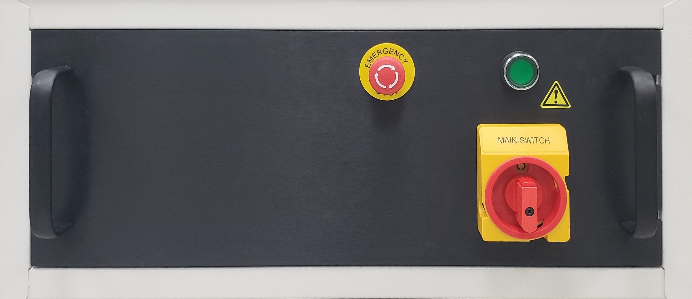

# 🛑 Emergency Power-Off

The Ontos3 is equipped with an EPO[^1] button. The red emergency Power Off button is prominently located and easily accessible below.

<figure><figcaption>
Emergency Power-Off button
</figcaption></figure>


#### To stop the machine in an emergency, press the red Emergency Power Off button.

#### To release the EPO button, twist it clockwise and it will pop back out.



Once the Emergency Power Off button has been activated, the system needs to be completely powered down and restarted for the system to power back on.


[^1]: 
