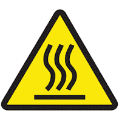
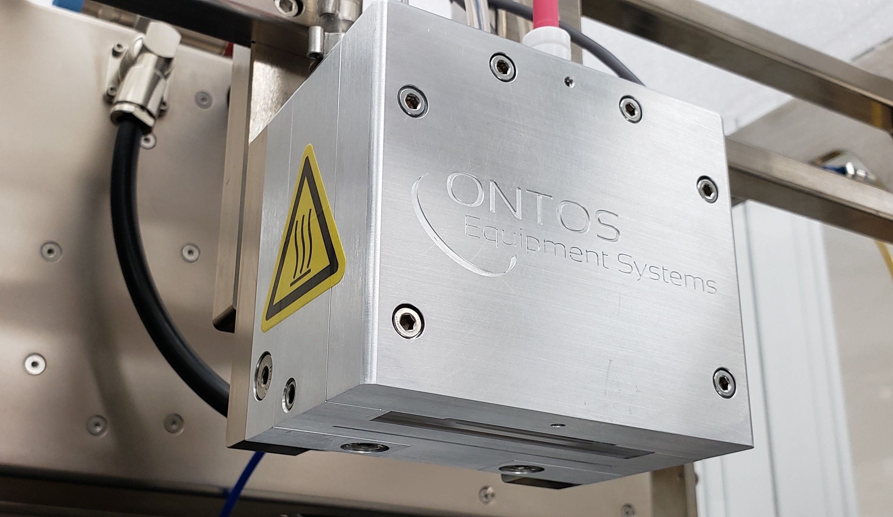

# 🖐 Physical Risk


Warning symbols such as these may be installed on your machine to indicate areas of specific pinch or thermal hazard.


<figure><figcaption>
Warning Symbol
</figcaption></figure>

Physical risk may be present at the Plasma Head which emits a plume from the reaction inside which may include hot gases. The plasma head can reach temperatures of 120C during and after processing. The surfaces are marked with warning labels. Exercise caution if you need to touch the plasma head or surrounding structure.

