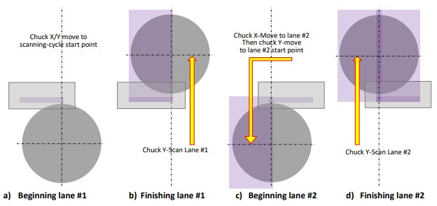

# Illustration of a Scanning Cycle

A scanning cycle involves scanning two lanes to cover the wafer surface with a positive overlap, using the installed plasma head aperture. Here's an overview of the cycle:

1. **Starting Point \[a]**: The chuck is automatically positioned below the plasma head to begin the scanning cycle.
2. **Scan Line Lane #1 \[b]**: The chuck moves in the Y-axis to scan the first lane.
3. **Transition to Lane #2 \[c]**: The chuck moves along the X-axis to transition from lane #1 to lane #2 and along the Y-axis to position the component beneath the plasma head at the start of lane #2.
4. **Scan Lane #2 \[d]**: The chuck moves along the Y-axis again to scan the second lane.
5. **Additional Cycles**: If more cycles are specified, the process repeats, starting again from step \[a].

<figure><figcaption>
Illustration of Scan Cycle 
</figcaption></figure>

Understanding and configuring these parameters allows you to tailor the scanning cycle precisely to your process requirements, ensuring accurate and effective treatment of substrates.
