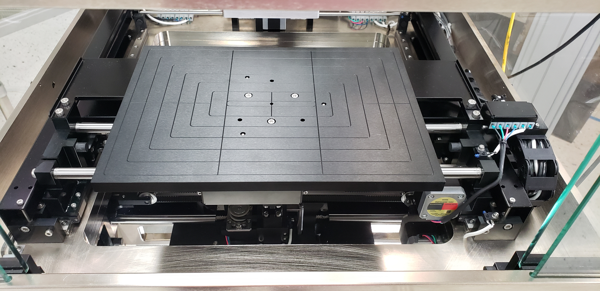

# 3-Axis Stage

The motion stage consists of an X, Y, and Z axis. The stage is controlled using the Ontos3 software controls.

1. Movement of the stage is relative to the stationary plasma head.
2. The chuck size is based off whether the system is a 200mm or 300mm plasma head.
3. The chuck includes a vacuum pattern as well as lift pins.


The chuck is easily swapped out. Its shape may vary (round, square, rectangular) as well as the vacuum areas. The substrate chuck can be customized upon request.

