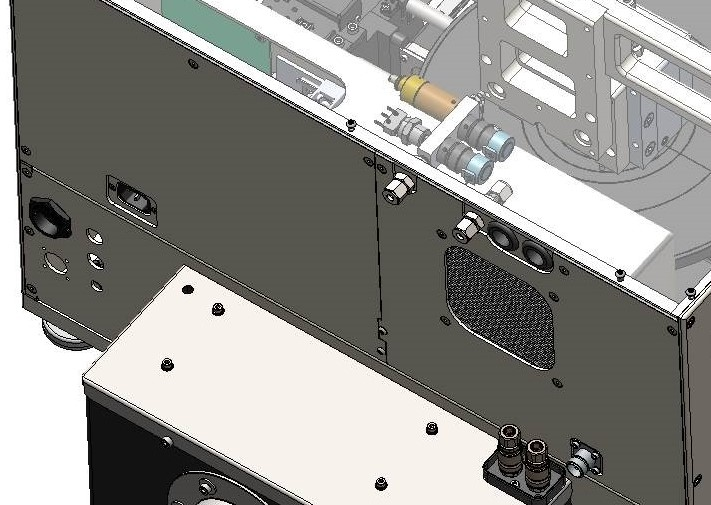

# ♻ Nitrogen Purge Valve

The nitrogen purge assembly regulates the flow of nitrogen through the plasma head to internally purge to prevent secondary plasma.

The nitrogen purge also serves a function in substrate inerting and cooling.&#x20;


**The nitrogen purge pressure regulator is factory set. It should not be readjusted.**


<figure><figcaption>
Nitrogen Purge Valve
</figcaption></figure>

