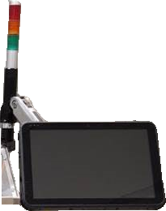
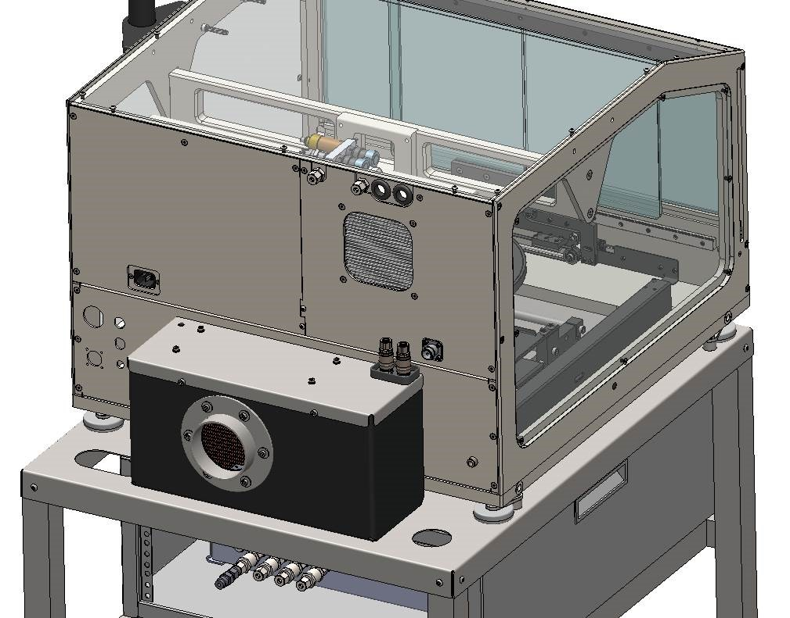
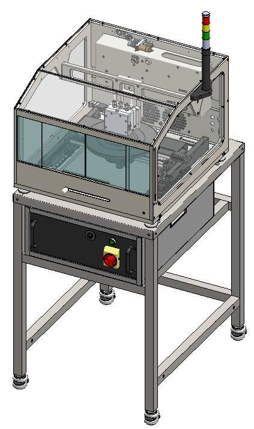

# Subsystems

The Ontos3 consists of eight subsystems as shown in below:

1. The Enclosure
2. Control Chassis
3. 3-Axis Stage
4. RF matching Network (Matchbox)
5. Plasma Head
6. Cooling System
7. Light Tower
8. Touchscreen PC & Joystick

