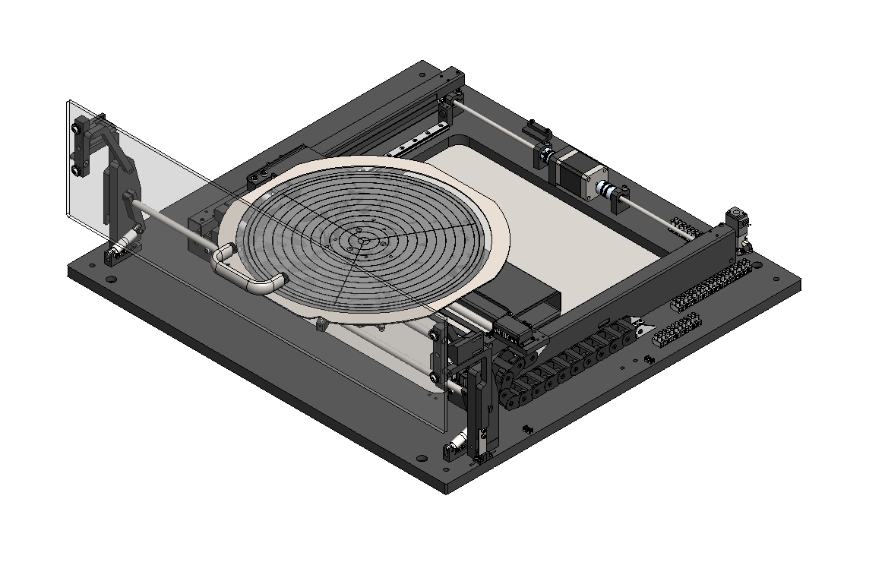

# 🔵 1. Axis Stage

**Section 1: 3-Axis Stage**

In this section, we'll delve into the dynamic capabilities and versatile features of the 3-Axis Stage, a pivotal component of the ONTOS _CLEAN_. This stage introduces motion across its X, Y, and Z axes, through the ONTOS _CLEAN_ software controls. Its movement is relative to the stationary plasma head with rapid movements or slow crawls based on recipes.

**1.1 Dynamic Motion**

The 3-Axis Stage offers dynamic and precise motion along the X, Y, and Z axes. This movement is coordinated through the ONTOS _CLEAN_ software controls.

**1.2 Chuck Configuration**

The chuck integrated into the 3-Axis Stage features a 300mm configuration. This dimension ensures compatibility with a wide array of substrates. The chuck is designed encompassing a vacuum pattern to ensure secure substrate adherence. Furthermore, lift pins are incorporated into the design of the chuck to allow substrates to be loaded and unloaded easily.

**1.3 Motion Interruption and Resumption**

The 3-Axis Stage is designed to halt its motion immediately upon the opening of the equipment's door. The motion can be resumed by simply closing the door, providing a user-friendly experience without compromising stage movement.

**1.4 Customization Options**

To accommodate diverse processing requirements, the 3-Axis Stage offers customization options. Specifically, custom chucks compatible with tape frames are available. Moreover, should your application demand a unique design, our team is prepared to craft tailored solutions upon request.

**1.5 Precision and Adaptability**

The 3-Axis Stage is a crucial system of the ONTOS _CLEAN_, demonstrating precision and customizability in motion. This adaptability caters to a multitude of processing needs, ensuring performance across various applications.

<figure><figcaption>
Stage Assembly - PN#
</figcaption></figure>
