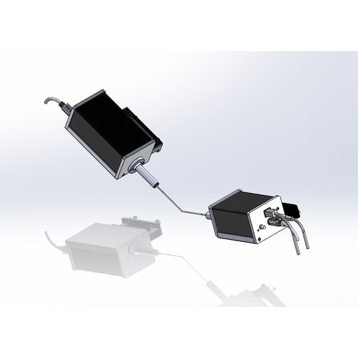

# ⚪ 10. Elipsometry System

**Section 10: Ellipsometer**

In this section, we will delve into the role of the Ellipsometer subsystem within the ONTOS _CLEAN_. This advanced module serves as a crucial tool for pre- and post-substrate measurements, allowing the user to assess plasma treatment efficacy.

**10.1 Substrate Measurement**

The Ellipsometer subsystem plays an integral role in analyzing substrate properties. Before and after plasma treatment, the Ellipsometer precisely measures key parameters, providing critical insights into the changes induced by the treatment process.

**10.2 Determining Efficacy**

Through meticulous measurements, the Ellipsometer assists in determining the efficacy of the plasma treatment. By comparing pre- and post-treatment data, users can assess alterations in various recipe properties, such as gas flows, stage manipulation, RF power, and more.

**10.3 Accurate and Non-Destructive Analysis**

One of the distinguishing features of the Ellipsometer is its non-destructive nature. It provides accurate and comprehensive information without compromising the integrity of the substrate. This non-invasive approach ensures that substrate samples remain intact.

**10.4 Enhanced Process Control**

The data collected by the Ellipsometer contributes to enhanced process control. By understanding the changes induced by the plasma treatment, users can fine-tune parameters to achieve desired outcomes with a higher degree of precision.

**10.5 Integration with the ONTOS **_**Clean**_** System**

The Ellipsometer subsystem is seamlessly integrated into the ONTOS _CLEAN_, reinforcing its capabilities. This integration simplifies the measurement process and facilitates efficient data examination, streamlining workflow.

**10.6 Comprehensive Analysis**

From thin films to complex multilayer structures, the Ellipsometer excels in delivering comprehensive analysis. Its versatility makes it an indispensable tool for understanding the impact of plasma treatment across a diverse range of applications.

By incorporating this module, users can confidently evaluate the effects of plasma treatment and refine their processes for optimal results.

<figure><figcaption></figcaption></figure>
