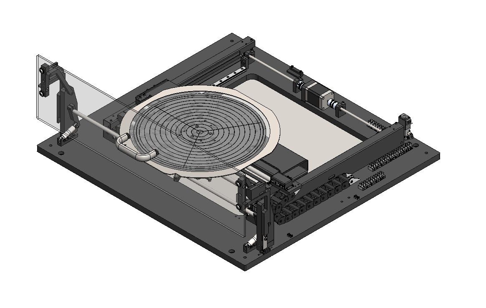

# 🔵 3-Axis Stage - Overview

The 3-axis stage introduces dynamic motion through its X, Y, and Z axes, orchestrated by the Ontos3 software controls. This movement is in relation to the stationary plasma head, allowing for precise positioning and rapid movement.

The chuck's dimensions is a 300mm configuration. The chuck encompasses a vacuum pattern for substrate adherence and incorporates lift pins to facilitate efficient loading and unloading.


The stage's motion halts immediately upon opening the door and can be resumed by closing the door.&#x20;



Custom chucks are available that are tape frame compatible and other application designs can be made upon request. &#x20;


This 3-axis stage forms a key element of the Ontos3, piloting in precise control and adaptability to cater to a variety of processing needs.

<figure><figcaption>
Stage Assembly - PN#
</figcaption></figure>
