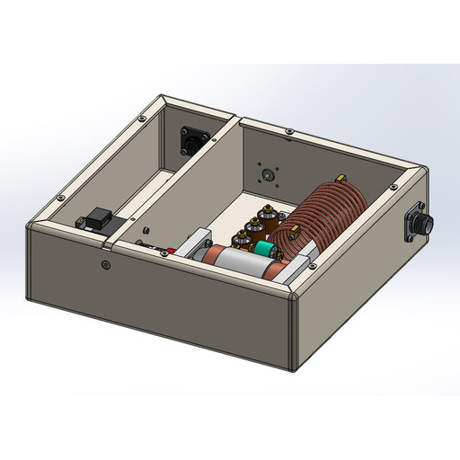

# 🟡 4. Vacuum Cap Matchbox Assembly

**4.1 Functionality**

The Matchbox System plays a pivotal role in your equipment's operation. It acts as a bridge between the RF Generator Module and the Plasma Head, optimizing the RF signal for efficient transmission. The Matchbox System receives RF power from the generator and refines the signal to ensure it's tailored for the Plasma Head's variable impedance.

**4.2 Signal Conditioning**

The heart of the Matchbox System's functionality lies in its signal conditioning process. This process aligns the variable impedance characteristics of the Plasma Head with those of the RF Generator Module. By doing so, it minimizes the potential for reflected RF energy, ensuring that the maximum power is efficiently transferred to the Plasma Head.

**4.3 Closed-Loop Feedback Mechanism**

Working in tandem with the RF Generator Module, the Matchbox System actively engages in an ongoing process of monitoring reflected power. Through a sophisticated closed-loop feedback mechanism, any deviations or irregularities can be detected. The Matchbox System then adjusts to optimize the signal and minimize any impedance mismatch.

**4.4 Scalability**

The Matchbox System offers scalability to accommodate various equipment configurations. Depending on your specific setup, you may employ one Matchbox per Plasma Head and Control Chassis combination. This flexibility ensures that the system can be tailored to meet your precise operational requirements.

**4.5 Troubleshooting**

If you encounter issues with the Matchbox System, refer to [Troubleshooting the ONTOS Clean System](../../troubleshooting/troubleshooting-the-ontos-clean-system.md) for guidance. For concerns or queries, don't hesitate to reach out to your equipment service provider for expert assistance.

\

<figure><figcaption>
Matchbox Tuner
</figcaption></figure>

