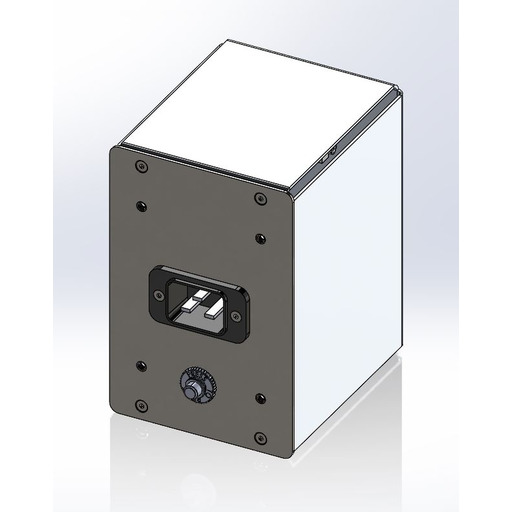

# ⚫ 5. A/C Distribution Box

**Section 5: A/C Distribution Box**

In this section, you'll find essential information about the A/C Distribution Box, a component of your ONTOS _CLEAN's_ power management system. Please review this section carefully to understand its functionality, safety considerations, and maintenance requirements.

**5.1 Functionality**

The A/C Distribution Box is responsible for efficiently distributing power from the main power source to various components within the system. It features multiple circuits and outlets designed to supply power to different subsystems.

**5.2 Safety Precautions**

Adhere to the following precautions when dealing with the A/C Distribution Box:


1. **Power Off:** Before performing any maintenance or inspections on the A/C Distribution Box, ensure the equipment is powered off and disconnected from the main power source. This prevents the risk of electrical shock or damage to the equipment.
2. **Qualified Personnel:** Only trained and authorized personnel should handle the A/C Distribution Box. If you encounter any issues or anomalies, contact your equipment service provider for assistance.
3. **Visual Inspection:** Regularly inspect the distribution box for any signs of wear, frayed cables, or unusual odors. If you notice any abnormalities, discontinue use and seek professional assistance.
4. **Ventilation:** Keep the area around the distribution box clear of obstructions to ensure proper ventilation and prevent overheating.


**5.3 Maintenance**

Maintaining the A/C Distribution Box is essential for uninterrupted equipment performance. Follow these maintenance guidelines:


1. **Dust and Debris:** Periodically clean the exterior of the distribution box using a dry, lint-free cloth. Avoid using liquids to prevent electrical hazards.
2. **Cable Management:** Ensure that cables are neatly organized and secured to prevent tangling or accidental disconnection.
3. **Temperature:** Ensure that the distribution box is operating within the specified temperature range. Excessive heat can impact its efficiency and lifespan.
4. **Scheduled Inspections:** Include regular inspections of the distribution box in your equipment maintenance schedule. Address any issues promptly to prevent potential disruptions.


**5.4 Troubleshooting**

Do not attempt to repair or modify the distribution box without proper authorization and expertise.

<figure><figcaption>
AC DISTRIBUTION BOX
</figcaption></figure>
