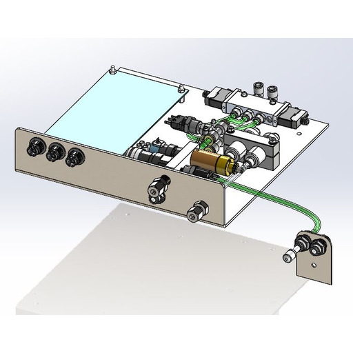

# 🟠 5. Upper Control Panel

**Section 5: Upper Control Panel**

This section provides a brief overview of the Upper Control Panel, a pivotal component of your equipment's functionality.

**5.1 Overview**

The Upper Control Panel serves as a central hub for critical operations and control. Within this panel, you will find:

* **Stage Controller:** The stage controller facilitates precise movement and positioning of components within the equipment.
* **Valves:** Various valves are integrated into the Upper Control Panel to regulate the flow of gases and fluids, ensuring precise process control.
* **N2 Purge:** The Nitrogen (N2) purge system maintains an inert atmosphere in designated areas for enhanced process stability.

These elements collectively contribute to the equipment's capabilities and efficiency, making the Upper Control Panel a vital control point.

<figure><figcaption>
Upper Control Panel - PN#0021-000064
</figcaption></figure>

