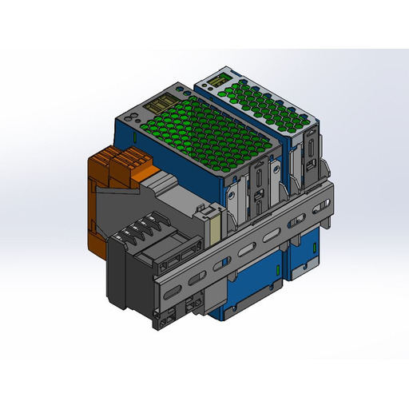

# 🟢 Control Chassis - Din Rail

The Din Rail system is made of the following components:

1. DC Power Supply 24V, 3.2A
2. DC Power Supply 24V, 10A
3. Safety Relay - ESTOP
4. miniature contactor
5. auxiliary contact

<figure><figcaption></figcaption></figure>
