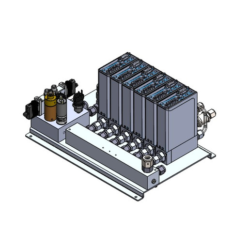

# 🟢 Control Chassis - Gas Delivery

The Gas Delivery Assembly is made up of the following components:

1. [N2/CDA Manifold](control-chassis-n2-manifold.md)
2. Gas Manifold
3. MFCs

<figure><figcaption></figcaption></figure>
