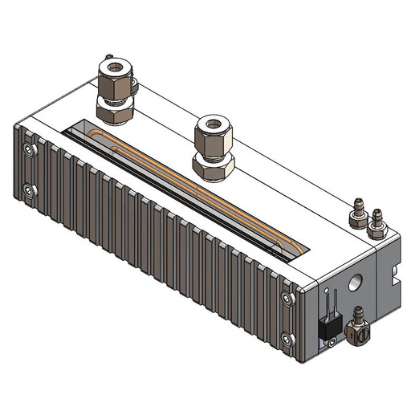

# 🟣 Plasma Head Assembly

The plasma head assembly consists of the following components:

1. 105mm Plasma Head
2. Plasma Cell Assembly
3. Rear cooling block

<figure><figcaption>
Plasma Head - PN#0021-000050
</figcaption></figure>

