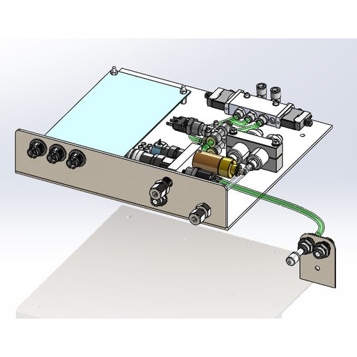

# 🟠 Upper Control Panel - Components

The upper control panel is made up of the following components:

1. [Auxiliary PCB](broken-reference)
2. Motion (3-Axis) PCB
3. [Plasma Cooling](broken-reference)&#x20;
4. [N2 Purge Assembly](broken-reference)
5. Gas Control Manifold
6. Internal Nitgrogen purge
7. Substrate purge&#x20;
8. CDA distribution
9. N2 pressure switch&#x20;
10. Gas Filters
11. Cooling directional valve
12. 24-5V transformer for elipseometer

<figure><figcaption>
Upper Control Panel - PN#0021-000064
</figcaption></figure>

