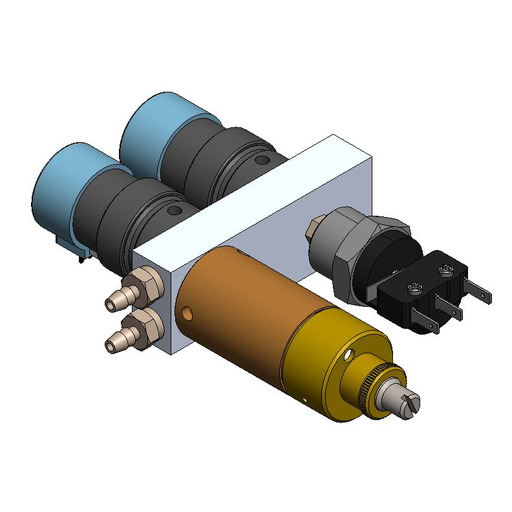

# 🟠 Upper Control Panel - N2 Puge Valve

The nitrogen purge assembly is responsible for governing the nitrogen flow within the plasma head, serving a critical role in internal purging to avert secondary plasma formation.&#x20;

Additionally, the nitrogen purge system plays a vital dual role by facilitating substrate inerting and contributing to effective cooling processes


**The nitrogen purge pressure regulator is factory set. It should not be readjusted.**


<figure><figcaption>
Nitrogen Purge Valve
</figcaption></figure>

