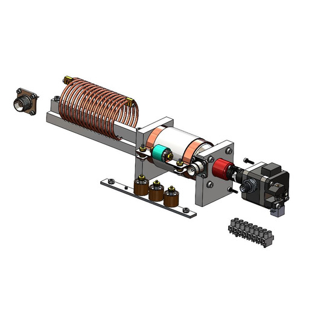

# 🟡 Vacuum Cap Matchbox Assembly - Matchbox Group

The Matchbox group consists of the following components:

1. Stepper Motor
2. Vac Cap Matchbox
3. Potentiometer
4. Capacitors
5. Flexible Shafts

<figure><figcaption>
Matchbox Group - PN#0018-000008
</figcaption></figure>

