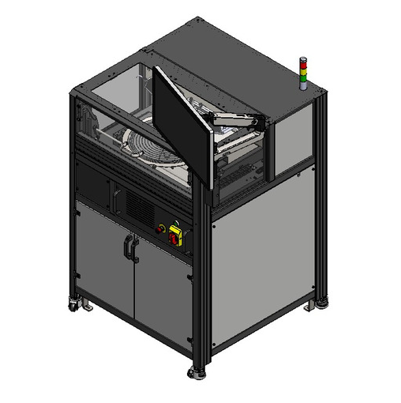

# What is the ONTOS Clean?

The ONTOS _Clean_ Atmospheric Plasma Surface Preparation System creates a plasma using a mixture of process gases to clean the surface, reduce native oxides, activate surfaces, or otherwise prepare a sample surface prior to the next process step.&#x20;

Typical downstream processes might include soldering, joining, bonding, etching, deposition, plating, or other semiconductor fabrication or assembly steps.&#x20;

<figure><figcaption>
Ontos3 System
</figcaption></figure>

