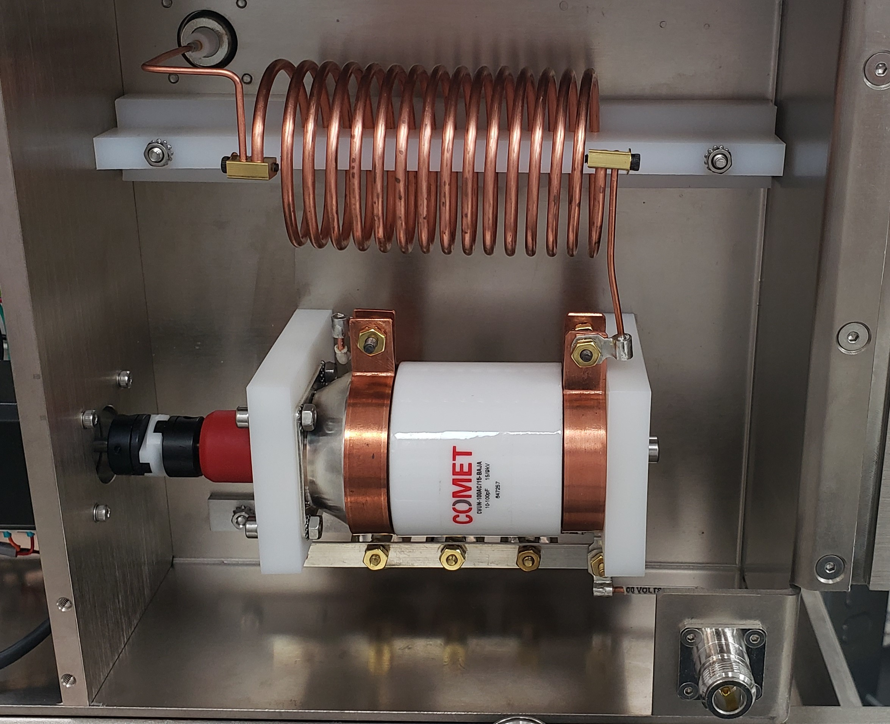

# RF Matching Circuit

#### RF Impedance Matching Network Module&#x20;

1. This module receives RF power from the RF Generator Module, conditions the RF signal, and sends the conditioned signal to the Plasma Head.
2. The signal conditioning matches the variable impedance of the Plasma Head to the RF Generator Module to minimize reflected RF energy.
3. The module works in conjunction with the RF Generator Module to continuously monitor reflected power and tune the network by closed-loop feedback.
4. One matchbox for each plasma head/Control chassis may be used based on your configuration as seen below

